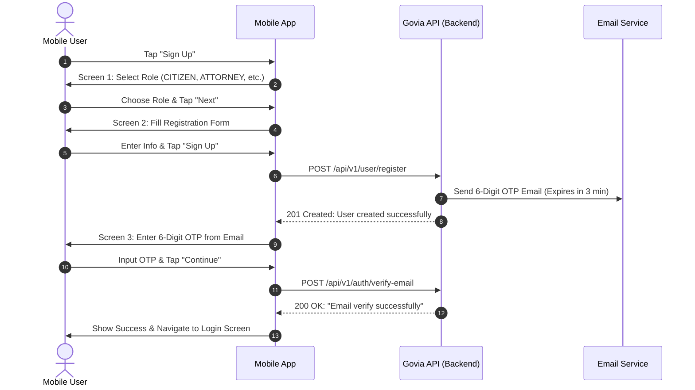
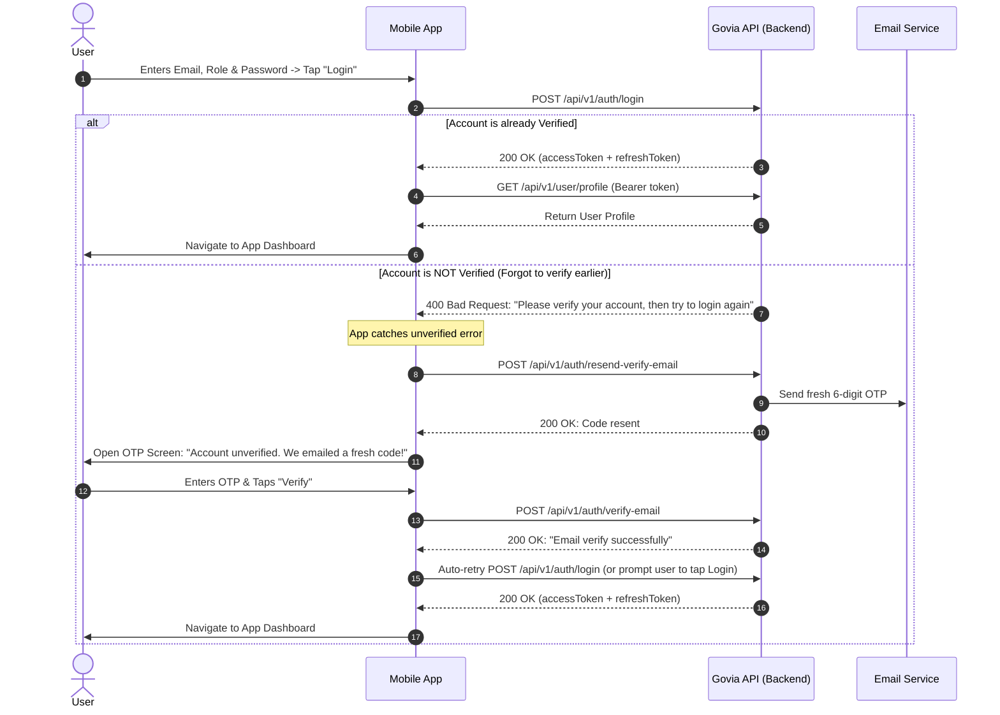
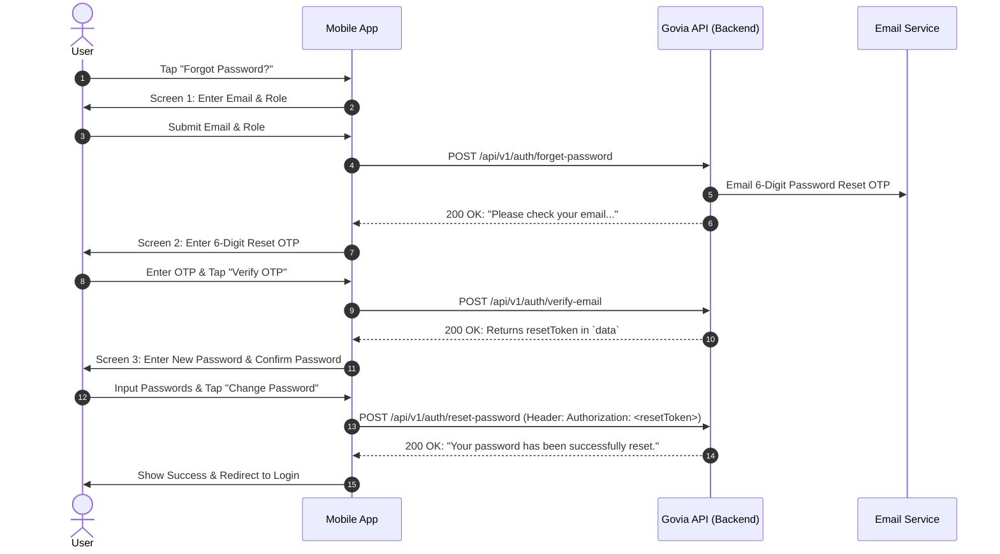

# Govia App Developer Authentication Integration Guide

> **Target Audience**: Mobile Developers (Flutter / React Native / iOS / Android) & Frontend Engineers  
> **Backend Base URL (Live Production)**: `http://172.252.13.197:9777/api/v1`  
> **Interactive Swagger Documentation**: `http://172.252.13.197:9777/api/v1/docs`  
> **Auth Header Format**: `Authorization: Bearer <accessToken>`

---

## Table of Contents
1. [Architecture & Roles Overview](#1-architecture--roles-overview)
2. [Standard Request & Response Envelopes](#2-standard-request--response-envelopes)
3. [Flow 1: New User Registration & Verification](#3-flow-1-new-user-registration--verification)
4. [Flow 2: Login & Unverified Account Auto-Recovery](#4-flow-2-login--unverified-account-auto-recovery)
5. [Flow 3: Forgot Password & Password Reset](#5-flow-3-forgot-password--password-reset)
6. [Additional Auth Endpoints](#6-additional-auth-endpoints)
7. [Complete Flutter / Dart Integration Code (Copy-Paste)](#7-complete-flutter--dart-integration-code-copy-paste)
8. [Complete TypeScript / React Native Example](#8-complete-typescript--react-native-example)
9. [Error Codes & Troubleshooting Table](#9-error-codes--troubleshooting-table)

---

## 1. Architecture & Roles Overview

Every user account in Govia is tied to an **Email** and a **Role**. The role must be provided in authentication requests because roles have distinct permission sets and profile requirements.

### Supported User Roles (`USER_ROLES`)
| Role Enum Value | Description / Target Screen |
| :--- | :--- |
| `CITIZEN` | General citizen user seeking assistance, records, or legal aid |
| `USER` | Standard community member |
| `ATTORNEY` | Legal professional / Lawyer |
| `BAIL_BONDSMAN` | Bail agency representative |
| `POLICE` | Law enforcement personnel |
| `MENTAL_HEALTH_PROFESSIONAL` | Healthcare & support specialist |
| `ADMIN` / `SUPER_ADMIN` | Management & System Administrators |

### Base URLs by Environment
| Environment | Base URL |
| :--- | :--- |
| **Live Production Server (VPS)** | `http://172.252.13.197:9777/api/v1` |
| **Android Emulator (Local Dev)** | `http://10.0.2.2:5000/api/v1` |
| **iOS Simulator (Local Dev)** | `http://localhost:5000/api/v1` |
| **Physical Device (WiFi)** | `http://<YOUR_COMPUTER_LAN_IP>:5000/api/v1` |

---

## 2. Standard Request & Response Envelopes

All Govia API endpoints follow a consistent JSON envelope structure.

### 2.1 Success Response (`200 OK` / `201 Created`)
```json
{
  "success": true,
  "statusCode": 200,
  "message": "Operation completed successfully.",
  "data": { ... }
}
```

### 2.2 Error Response (`400 Bad Request`, `401 Unauthorized`, `403 Forbidden`, `404 Not Found`)
```json
{
  "success": false,
  "message": "Error description message",
  "errorMessages": [
    {
      "path": "email",
      "message": "Email is required"
    }
  ]
}
```

---

## 3. Flow 1: New User Registration & Verification



### Step 1: Role Selection
Before presenting the registration fields, prompt the user to choose their role (e.g. `CITIZEN`, `ATTORNEY`, `POLICE`, `MENTAL_HEALTH_PROFESSIONAL`, etc.). Save the selected role in the app's signup state.

### Step 2: Submit Registration Form
- **Method**: `POST`
- **Path**: `/api/v1/user/register`
- **Headers**: `Content-Type: application/json`

#### Request Body
```json
{
  "name": "Alex Johnson",
  "email": "alex.johnson@example.com",
  "password": "Password123!",
  "role": "CITIZEN",
  "phoneNumber": "+1234567890",
  "languagesSpoken": "English, Spanish",
  "preferredAttorney": "Optional preferred attorney",
  "preferredBailBondsman": "Optional bail agency"
}
```

> **Role-Specific Optional Fields**:
> - **Attorneys**: `lawFirmName`, `barAssociationNumber`, `datePassedTheBar`, `licensedStatesToPractice`, `officeName`
> - **Mental Health Professionals**: `medicalLicenseNumber`, `specialization`, `companyName`, `businessAddress`
> - **Police**: `badgeNumber`, `assignedNumber`, `departmentOrPrecinct`, `licenseNumber`

#### Response (`201 Created` / `200 OK`)
```json
{
  "success": true,
  "statusCode": 200,
  "message": "User created successfully!",
  "data": {
    "_id": "67cb1a409f87...",
    "name": "Alex Johnson",
    "email": "alex.johnson@example.com",
    "role": "CITIZEN",
    "verified": false,
    "status": "active",
    "createdAt": "2026-09-07T08:00:00.000Z"
  }
}
```
*At this point, the backend has generated a 6-digit OTP (valid for 3 minutes) and emailed it to the user.*

---

### Step 3: Enter OTP & Verify Email
Navigate the user to the **OTP Verification Screen**. Keep `email` and `role` in the screen parameters.

- **Method**: `POST`
- **Path**: `/api/v1/auth/verify-email`
- **Headers**: `Content-Type: application/json`

#### Request Body
```json
{
  "email": "alex.johnson@example.com",
  "role": "CITIZEN",
  "oneTimeCode": 583921
}
```
*(Note: `oneTimeCode` can be sent as an integer `583921` or string `"583921"`).*

#### Response (`200 OK`)
```json
{
  "success": true,
  "statusCode": 200,
  "message": "Email verify successfully"
}
```

#### What if the OTP expired or wasn't received? (Resend OTP Button)
Provide a **"Resend Code"** button with a 60-second countdown timer:
- **Method**: `POST`
- **Path**: `/api/v1/auth/resend-verify-email`
- **Request Body**:
```json
{
  "email": "alex.johnson@example.com",
  "role": "CITIZEN"
}
```
- **Response (`200 OK`)**:
```json
{
  "success": true,
  "statusCode": 200,
  "message": "Verification code resent successfully."
}
```

### Step 4: Complete Registration
After receiving `"Email verify successfully"`, display a success confirmation dialog/toast and navigate the user to the **Login Screen**.

---

## 4. Flow 2: Login & Unverified Account Auto-Recovery



### Step 1: Login Request
- **Method**: `POST`
- **Path**: `/api/v1/auth/login`
- **Headers**: `Content-Type: application/json`

#### Request Body
```json
{
  "email": "alex.johnson@example.com",
  "role": "CITIZEN",
  "password": "Password123!"
}
```

#### Case A: Verified User (`200 OK`)
```json
{
  "success": true,
  "statusCode": 200,
  "message": "User logged in successfully.",
  "data": {
    "accessToken": "eyJhbGciOiJIUzI1NiIsInR5cCI6IkpXVCJ9...",
    "refreshToken": "eyJhbGciOiJIUzI1NiIsInR5cCI6IkpXVCJ9..."
  }
}
```
**Action**:
1. Save `accessToken` and `refreshToken` in Secure Storage (`flutter_secure_storage` or Keychain).
2. Fetch current user profile via `GET /api/v1/user/profile` using `Authorization: Bearer <accessToken>`.
3. Route to main app screen.

---

#### Case B: Unverified Account Recovery (`400 Bad Request`)
If the user registered previously but never verified their OTP, the API returns:
```json
{
  "success": false,
  "message": "Please verify your account, then try to login again"
}
```

**Mobile App Integration Logic**:
1. Inspect `response.data['message']`. If it contains `"verify your account"`:
2. Automatically call `POST /api/v1/auth/resend-verify-email` with `{ email, role }`.
3. Seamlessly navigate user to the **OTP Verification Screen** with the message:  
   *"Your account is not verified yet. We have sent a fresh 6-digit code to your email."*
4. User enters the OTP -> App calls `POST /api/v1/auth/verify-email`.
5. Upon successful verification, the app can either:
   - Automatically execute the login request and proceed directly to the dashboard, OR
   - Show a success toast and return to the Login screen with email pre-filled.

---

## 5. Flow 3: Forgot Password & Password Reset



### Step 1: Request Password Reset Code
- **Method**: `POST`
- **Path**: `/api/v1/auth/forget-password`
- **Headers**: `Content-Type: application/json`

#### Request Body
```json
{
  "email": "alex.johnson@example.com",
  "role": "CITIZEN"
}
```

#### Response (`200 OK`)
```json
{
  "success": true,
  "statusCode": 200,
  "message": "Please check your email. We have sent you a one-time passcode (OTP)."
}
```

---

### Step 2: Verify Reset OTP & Obtain Reset Token
The user enters the 6-digit OTP received in their email.

- **Method**: `POST`
- **Path**: `/api/v1/auth/verify-email`
- **Headers**: `Content-Type: application/json`

#### Request Body
```json
{
  "email": "alex.johnson@example.com",
  "role": "CITIZEN",
  "oneTimeCode": 492018
}
```

#### Response (`200 OK`)
Because the user's account is already verified, the API detects this is a password-reset verification and returns a **Reset Token** in `data`:
```json
{
  "success": true,
  "statusCode": 200,
  "message": "Verification Successful: Please securely store and utilize this code for reset password",
  "data": "98075323a6b57cb8c519bfb776269df9b3e648834ad1b7829d201a4e50882e37"
}
```

> **IMPORTANT**:  
> Extract `response.data['data']` string. This is the **`resetToken`** (valid for 5 minutes). Pass it to the next screen (New Password Screen).

---

### Step 3: Set New Password
Navigate user to the **Set New Password Screen** with `resetToken`.

- **Method**: `POST`
- **Path**: `/api/v1/auth/reset-password`
- **Headers**: 
  - `Content-Type: application/json`
  - `Authorization: Bearer <resetToken>` *(or direct `<resetToken>`)*

#### Request Body
```json
{
  "newPassword": "NewStrongPassword123!",
  "confirmPassword": "NewStrongPassword123!"
}
```

#### Response (`200 OK`)
```json
{
  "success": true,
  "statusCode": 200,
  "message": "Your password has been successfully reset."
}
```

**Action**: Display success confirmation dialog and navigate the user to **Login Screen**.

---

## 6. Additional Auth Endpoints

### 6.1 Refresh Access Token
Use when the access token expires (`401 Unauthorized`).
- **Method**: `POST`
- **Path**: `/api/v1/auth/refresh`
- **Headers**: `Content-Type: application/json`
- **Request Body**:
```json
{
  "refreshToken": "<your_refresh_token>"
}
```
- **Response (`200 OK`)**:
```json
{
  "success": true,
  "statusCode": 200,
  "message": "Access token refreshed successfully.",
  "data": {
    "accessToken": "eyJhbGciOiJIUzI1NiIsInR5cCI6IkpXVCJ9..."
  }
}
```

---

### 6.2 Change Password (When Already Logged In)
- **Method**: `POST`
- **Path**: `/api/v1/auth/change-password`
- **Headers**:
  - `Content-Type: application/json`
  - `Authorization: Bearer <accessToken>`
- **Request Body**:
```json
{
  "currentPassword": "CurrentPassword123!",
  "newPassword": "NewPassword456!",
  "confirmPassword": "NewPassword456!"
}
```
- **Response (`200 OK`)**:
```json
{
  "success": true,
  "statusCode": 200,
  "message": "Your password has been successfully changed"
}
```

---

### 6.3 Get Logged-In User Profile
- **Method**: `GET`
- **Path**: `/api/v1/user/profile`
- **Headers**:
  - `Authorization: Bearer <accessToken>`
- **Response (`200 OK`)**:
```json
{
  "success": true,
  "statusCode": 200,
  "message": "User profile fetched successfully",
  "data": {
    "_id": "67cb1a409f87...",
    "name": "Alex Johnson",
    "email": "alex.johnson@example.com",
    "role": "CITIZEN",
    "image": "https://i.ibb.co/z5YHLV9/profile.png",
    "phoneNumber": "+1234567890",
    "languagesSpoken": "English, Spanish",
    "status": "active",
    "verified": true
  }
}
```

---

## 7. Complete Flutter / Dart Integration Code (Copy-Paste)

### 7.1 `lib/core/api_client.dart`
```dart
import 'package:dio/dio.dart';
import 'package:flutter_secure_storage/flutter_secure_storage.dart';

class ApiClient {
  static const String baseUrl = 'http://172.252.13.197:9777/api/v1';
  final Dio dio = Dio(BaseOptions(
    baseUrl: baseUrl,
    connectTimeout: const Duration(seconds: 15),
    receiveTimeout: const Duration(seconds: 15),
    headers: {'Content-Type': 'application/json'},
  ));

  final FlutterSecureStorage storage = const FlutterSecureStorage();

  ApiClient() {
    dio.interceptors.add(
      InterceptorsWrapper(
        onRequest: (options, handler) async {
          final token = await storage.read(key: 'accessToken');
          if (token != null && !options.headers.containsKey('Authorization')) {
            options.headers['Authorization'] = 'Bearer $token';
          }
          return handler.next(options);
        },
        onError: (DioException error, handler) async {
          // Token refresh logic if 401
          if (error.response?.statusCode == 401) {
            final refreshToken = await storage.read(key: 'refreshToken');
            if (refreshToken != null) {
              try {
                final refreshRes = await dio.post('/auth/refresh', data: {
                  'refreshToken': refreshToken,
                });
                final newAccessToken = refreshRes.data['data']['accessToken'];
                await storage.write(key: 'accessToken', value: newAccessToken);

                // Retry original request
                final opts = error.requestOptions;
                opts.headers['Authorization'] = 'Bearer $newAccessToken';
                final cloneReq = await dio.request(
                  opts.path,
                  options: Options(method: opts.method, headers: opts.headers),
                  data: opts.data,
                  queryParameters: opts.queryParameters,
                );
                return handler.resolve(cloneReq);
              } catch (_) {
                await storage.deleteAll();
              }
            }
          }
          return handler.next(error);
        },
      ),
    );
  }
}
```

---

### 7.2 `lib/services/auth_service.dart`
```dart
import 'package:dio/dio.dart';
import '../core/api_client.dart';

class AuthService {
  final ApiClient _client = ApiClient();

  /// 1. Register new user
  Future<Map<String, dynamic>> register({
    required String name,
    required String email,
    required String password,
    required String role,
    String? phoneNumber,
    String? languagesSpoken,
    Map<String, dynamic>? roleSpecificFields,
  }) async {
    final Map<String, dynamic> payload = {
      'name': name,
      'email': email.trim().toLowerCase(),
      'password': password,
      'role': role,
      if (phoneNumber != null) 'phoneNumber': phoneNumber,
      if (languagesSpoken != null) 'languagesSpoken': languagesSpoken,
      if (roleSpecificFields != null) ...roleSpecificFields,
    };

    final response = await _client.dio.post('/user/register', data: payload);
    return response.data;
  }

  /// 2. Verify Email OTP (Used for both Registration and Forgot Password)
  Future<Map<String, dynamic>> verifyEmailOtp({
    required String email,
    required String role,
    required dynamic oneTimeCode, // accepts int or String
  }) async {
    final int code = oneTimeCode is int ? oneTimeCode : int.parse(oneTimeCode.toString());
    final response = await _client.dio.post('/auth/verify-email', data: {
      'email': email.trim().toLowerCase(),
      'role': role,
      'oneTimeCode': code,
    });
    return response.data;
  }

  /// 3. Resend Verification OTP
  Future<void> resendVerificationOtp({
    required String email,
    required String role,
  }) async {
    await _client.dio.post('/auth/resend-verify-email', data: {
      'email': email.trim().toLowerCase(),
      'role': role,
    });
  }

  /// 4. Login with Unverified Account Auto-Recovery Handling
  Future<Map<String, dynamic>> login({
    required String email,
    required String role,
    required String password,
  }) async {
    try {
      final response = await _client.dio.post('/auth/login', data: {
        'email': email.trim().toLowerCase(),
        'role': role,
        'password': password,
      });

      final data = response.data['data'];
      await _client.storage.write(key: 'accessToken', value: data['accessToken']);
      await _client.storage.write(key: 'refreshToken', value: data['refreshToken']);
      return {'status': 'SUCCESS', 'data': data};
    } on DioException catch (e) {
      final message = e.response?.data?['message'] ?? e.message ?? '';

      // Unverified Account Catch
      if (message.toString().toLowerCase().contains('verify your account')) {
        // Trigger fresh OTP email
        await resendVerificationOtp(email: email, role: role);
        return {
          'status': 'UNVERIFIED',
          'message': 'Account not verified. A fresh OTP has been sent to your email.',
          'email': email,
          'role': role,
        };
      }

      throw Exception(message);
    }
  }

  /// 5. Forgot Password Request
  Future<void> requestPasswordReset({
    required String email,
    required String role,
  }) async {
    await _client.dio.post('/auth/forget-password', data: {
      'email': email.trim().toLowerCase(),
      'role': role,
    });
  }

  /// 6. Submit New Password with Reset Token
  Future<void> resetPassword({
    required String resetToken,
    required String newPassword,
    required String confirmPassword,
  }) async {
    await _client.dio.post(
      '/auth/reset-password',
      options: Options(headers: {'Authorization': 'Bearer $resetToken'}),
      data: {
        'newPassword': newPassword,
        'confirmPassword': confirmPassword,
      },
    );
  }

  /// 7. Fetch User Profile
  Future<Map<String, dynamic>> getProfile() async {
    final response = await _client.dio.get('/user/profile');
    return response.data['data'];
  }
}
```

---

## 8. Complete TypeScript / React Native Example

```typescript
import axios from 'axios';

const api = axios.create({
  baseURL: 'http://172.252.13.197:9777/api/v1',
  headers: { 'Content-Type': 'application/json' },
});

export const authApi = {
  // 1. Sign up
  register: (payload: { name: string; email: string; password: string; role: string }) =>
    api.post('/user/register', payload),

  // 2. Verify OTP
  verifyEmail: (payload: { email: string; role: string; oneTimeCode: number | string }) =>
    api.post('/auth/verify-email', {
      ...payload,
      oneTimeCode: Number(payload.oneTimeCode),
    }),

  // 3. Resend OTP
  resendOtp: (email: string, role: string) =>
    api.post('/auth/resend-verify-email', { email, role }),

  // 4. Login with Unverified Account Handler
  login: async (email: string, role: string, password: string) => {
    try {
      const res = await api.post('/auth/login', { email, role, password });
      return { status: 'SUCCESS', tokens: res.data.data };
    } catch (err: any) {
      const msg = err.response?.data?.message || '';
      if (msg.toLowerCase().includes('verify your account')) {
        await api.post('/auth/resend-verify-email', { email, role });
        return { status: 'UNVERIFIED', message: 'OTP sent to email. Verification required.' };
      }
      throw err;
    }
  },

  // 5. Request Forgot Password
  forgetPassword: (email: string, role: string) =>
    api.post('/auth/forget-password', { email, role }),

  // 6. Reset Password with Token
  resetPassword: (resetToken: string, newPassword: string, confirmPassword: string) =>
    api.post(
      '/auth/reset-password',
      { newPassword, confirmPassword },
      { headers: { Authorization: `Bearer ${resetToken}` } }
    ),
};
```

---

## 9. Error Codes & Troubleshooting Table

| Error Message | HTTP Status | Root Cause | App Developer Action |
| :--- | :--- | :--- | :--- |
| `"Please verify your account, then try to login again"` | `400` | User registered but hasn't entered OTP | Call `/auth/resend-verify-email` and push OTP screen |
| `"You provided wrong otp"` | `400` | The 6-digit code does not match database | Show error on OTP input: "Invalid code. Please re-enter." |
| `"Otp already expired, Please try again"` | `400` | OTP is older than 3 minutes | Prompt user to click "Resend Code" |
| `"Password is incorrect!"` | `400` | Wrong credentials | Show error: "Invalid email or password." |
| `"User doesn't exist!"` | `400` | No record matches `email` + `role` | Verify role selected matches the registered role |
| `"Token expired, Please click again to the forget password"` | `400` | Reset token > 5 minutes old | Navigate back to Forgot Password screen |
| `"New password and Confirm password doesn't match!"` | `400` | Passwords mismatch | Validate matching before sending request |
| `"You are not authorized"` | `401` | Missing / invalid Bearer token | Refresh token or redirect user to login |

---

### 📞 Summary Quick Reference
- **Sign Up**: `POST /api/v1/user/register`
- **Verify OTP**: `POST /api/v1/auth/verify-email`
- **Resend OTP**: `POST /api/v1/auth/resend-verify-email`
- **Login**: `POST /api/v1/auth/login`
- **Forgot Password**: `POST /api/v1/auth/forget-password`
- **Reset Password**: `POST /api/v1/auth/reset-password`
- **Token Refresh**: `POST /api/v1/auth/refresh`
- **Profile**: `GET /api/v1/user/profile`
