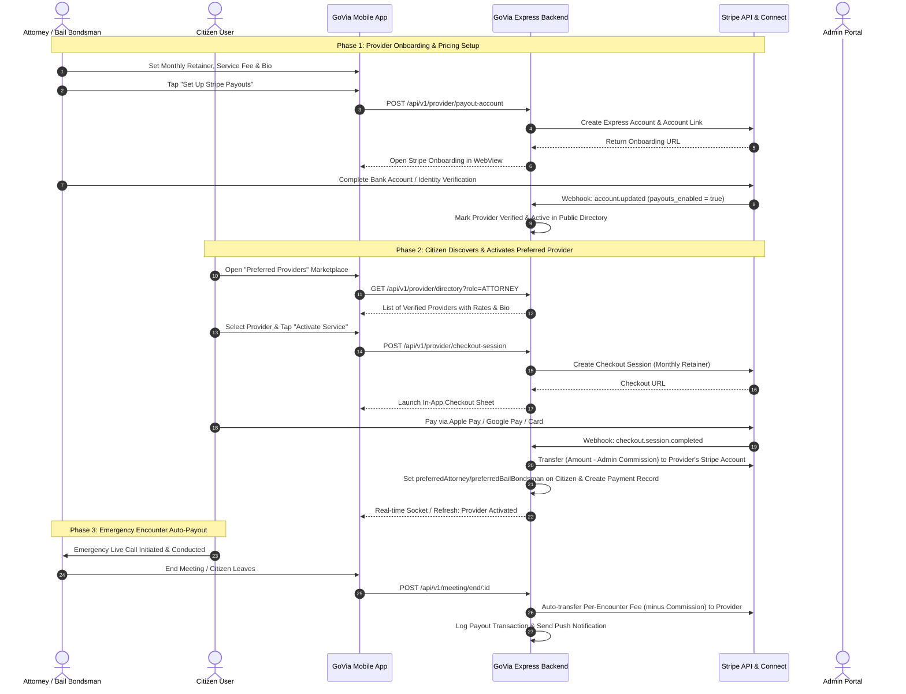

# Preferred Provider Payment & Payout System (Stripe Connect) Implementation Plan

## 1. System Overview & Architecture
The system enables Attorneys and Bail Bondsmen to monetize their services on GoVia through a dual-earning structure:
1. **Monthly Retainer:** Citizens pay a monthly service charge to activate and retain a designated Preferred Attorney or Bail Bondsman on their profile for 24/7 priority emergency dispatch.
2. **Per-Encounter Service Fee:** When an emergency encounter or consultation with the preferred provider concludes, the per-encounter service charge is automatically transferred/paid out to the provider via Stripe Connect.
3. **Platform Commission:** The Admin sets a global percentage commission (default: 10%) that GoVia retains from each transaction, with the remaining balance transferred directly to the provider's connected Stripe Express account.

---

## 2. Key Components to Implement

### A. Backend (`apps/backend`)
1. **Dependencies & Configuration:**
   - Install `stripe` package in `apps/backend`.
   - Add Stripe config to `.env` & `config/index.ts`:
     - `STRIPE_SECRET_KEY`
     - `STRIPE_PUBLISHABLE_KEY`
     - `STRIPE_WEBHOOK_SECRET`
2. **Database Schemas & Models:**
   - Update `User` model:
     - `serviceFee`: number (per-encounter fee in USD)
     - `monthlyServiceFee`: number (monthly retainer fee in USD)
     - `shortDescription`: string (bio / sales pitch)
     - `stripeAccountId`: string (Stripe Express connected account ID `acct_xxx`)
     - `stripeAccountStatus`: `'NOT_CREATED' | 'PENDING' | 'ACTIVE' | 'RESTRICTED'`
     - `payoutsEnabled`: boolean
     - `preferredAttorneyActiveUntil`: Date
     - `preferredBailBondsmanActiveUntil`: Date
   - New `CommissionSetting` model:
     - `platformCommissionPercent`: number (default: 10)
     - `updatedBy`: ObjectId
   - New `ProviderTransaction` model:
     - `transactionId`: string
     - `citizenId`: ObjectId
     - `providerId`: ObjectId
     - `type`: `'MONTHLY_RETAINER' | 'ENCOUNTER_FEE'`
     - `grossAmount`: number
     - `platformFee`: number
     - `providerAmount`: number
     - `currency`: string (default `'usd'`)
     - `status`: `'PENDING' | 'COMPLETED' | 'FAILED' | 'REFUNDED'`
     - `stripePaymentIntentId`: string
     - `stripeTransferId`: string
     - `meetingId`: ObjectId (optional, for encounter fee)
3. **Provider Module Endpoints:**
   - `POST /api/v1/provider/pricing-profile`: Update rates (`serviceFee`, `monthlyServiceFee`, `shortDescription`).
   - `POST /api/v1/provider/payout/onboard`: Create Stripe Express account & return onboarding URL.
   - `GET /api/v1/provider/payout/status`: Check connected account onboarding & balance status.
   - `GET /api/v1/provider/payout/dashboard-link`: Generate Stripe Express Login Link to view payouts.
   - `GET /api/v1/provider/directory`: Public endpoint for citizens to browse active, Stripe-verified attorneys and bail bondsmen with ratings, rates, and bios.
   - `POST /api/v1/provider/checkout-session`: Create Stripe Checkout Session for citizen to pay monthly retainer.
   - `GET /api/v1/provider/verify-session/:sessionId`: Verify checkout payment and activate preferred provider immediately.
4. **Encounter Auto-Payout in `MeetingService.endMeeting`:**
   - On encounter completion, inspect if the meeting host has a retained preferred attorney or bail bondsman with a per-encounter fee.
   - Execute automated Stripe Transfer to the provider's `stripeAccountId` deducting admin commission.
5. **Admin Commission & Payout Management Endpoints:**
   - `GET /api/v1/admin/commission`: View platform commission rate.
   - `PUT /api/v1/admin/commission`: Update platform commission percentage.
   - `GET /api/v1/admin/provider-transactions`: List all provider payments and platform revenue.
6. **Stripe Webhook Handler:**
   - `POST /api/v1/provider/webhook`: Process `checkout.session.completed`, `account.updated`, `transfer.created`.

---

### B. Mobile App (`apps/mobile`)
1. **Provider Profile (Attorney & Bail Bondsman):**
   - In Attorney & Bail Bondsman Profile screens:
     - Add "Service Pricing & Bio" card: inputs for Monthly Retainer ($), Per-Encounter Fee ($), and Short Bio.
     - Add "Stripe Payouts" status card:
       - If not onboarded: "Set Up Direct Bank Payouts" button -> Opens Stripe Express onboarding in WebView.
       - If onboarded: "Payouts Active (Stripe Connected)" badge with "View Payout Dashboard" link.
2. **Citizen Preferred Providers Screen:**
   - Revamp `PreferredProvidersView`:
     - Show currently active provider card with "Active (Valid until MM/DD/YYYY)" status badge.
     - "Browse & Add Preferred Attorney" and "Browse & Add Preferred Bail Bondsman" buttons.
     - Opens a curated Marketplace sheet/screen listing available providers:
       - Avatar, name, firm, state licenses, star rating, verified badge.
       - Short description / bio snippet.
       - Monthly Retainer Price ($X/mo) and Per-Encounter Fee ($Y/call).
     - Tap provider -> Details modal with full bio -> Tap "Activate Service ($X/mo)" -> Launches Stripe Hosted Checkout in in-app WebView sheet.
     - On completion: automatically updates citizen's preferred provider, shows celebration confirmation, and sets expiry.
3. **Meeting End Flow:**
   - Displays clear notification to provider that their per-encounter earnings have been transferred to their Stripe account.

---

### C. Admin Portal (`apps/admin`)
1. Commission Settings page:
   - Platform Commission slider/input (% fee).
2. Financial Transactions view:
   - Table of all citizen retainer payments, encounter payouts, platform commission retained, and provider payout statuses.

---

## 3. Stripe Webhook Setup Instructions for User
To handle automated events when citizens pay and when providers onboard:
1. Open [Stripe Dashboard](https://dashboard.stripe.com/test/webhooks).
2. Click **Add destination** or **Add endpoint**.
3. Set **Endpoint URL**: `https://api.govia.org/api/v1/provider/webhook` (or your local ngrok/backend URL).
4. Select the following **events to listen to**:
   - `checkout.session.completed`
   - `account.updated`
   - `transfer.created`
   - `payment_intent.succeeded`
5. After creating the webhook endpoint, copy the **Signing secret** (starts with `whsec_...`) and provide it to us to set `STRIPE_WEBHOOK_SECRET`.
